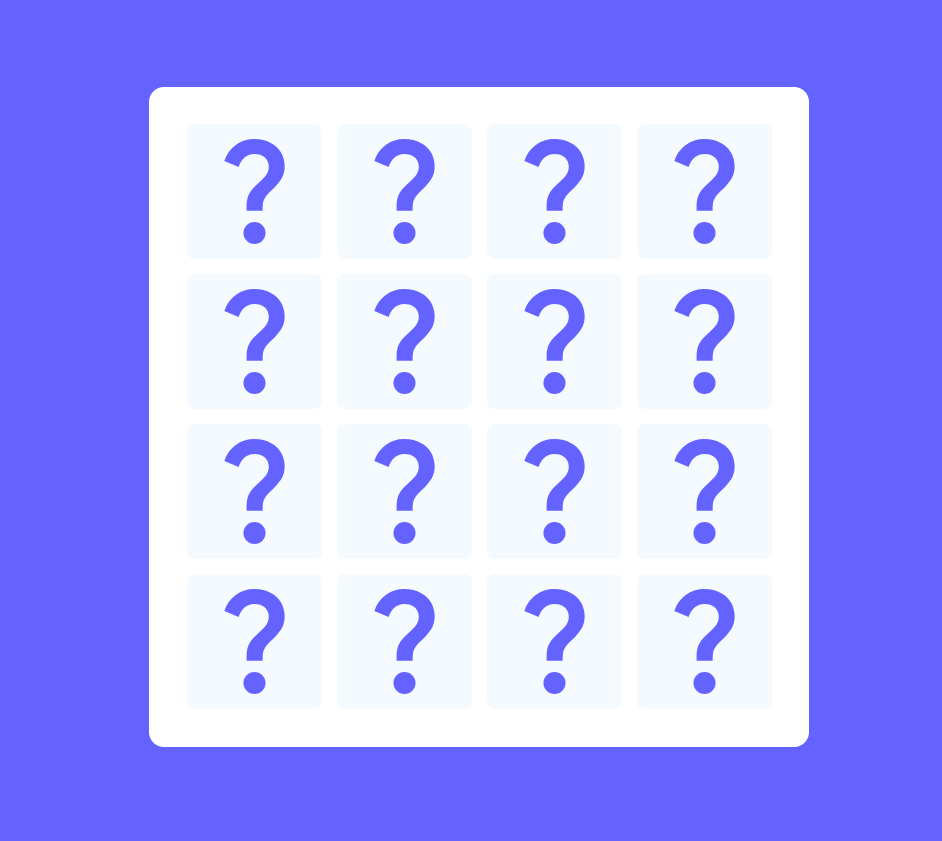
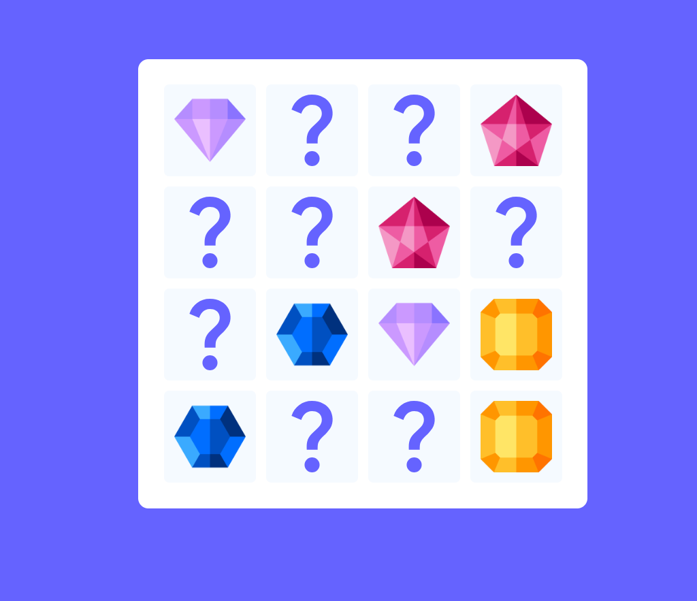

# Memory Card Game

A simple and interactive memory card game built with HTML, CSS, and JavaScript. Flip the cards, match pairs, and win the game!



## Features
- **Randomized Card Layout**: Cards are shuffled every time the game starts for a new challenge.
- **Flip Animation**: Smooth flipping animation for cards.
- **Win Notification**: A pop-up congratulates you when you’ve matched all pairs.
- **Easy Restart**: Restart the game anytime to try again.

## How to Play
1. Click on a card to flip it over and reveal the image.
2. Flip a second card and try to find a match.
3. If the cards match, they remain flipped over. If they don’t, they will flip back after a moment.
4. Continue matching pairs until all cards are matched, and a pop-up will congratulate you on winning.
5. Click the restart icon to play again.

## Screenshots


## Code Structure
- **HTML**: Defines the structure of the game, including the cards, pop-up, and main container.
- **CSS**: Provides styles for the cards, animations for flipping, and pop-up effects.
- **JavaScript**: Adds functionality for card shuffling, card matching, game restart, and win detection.

## Setup
To play this game locally:
1. Clone this repository:
    ```bash
    git clone https://github.com/dauntflash/Memory-card-game.git
    ```
2. Navigate to the project directory:
    ```bash
    cd Memory-card-game
    ```
3. Open `index.html` in your browser to start playing.

## Customization
Feel free to customize:
- **Images**: Replace images in the `assets` folder to change card faces.
- **Styles**: Update colors, fonts, or layouts in `style.css`.

## Future Improvements
- **Score Tracking**: Track the number of moves made to match all pairs.
- **Difficulty Levels**: Add different levels with more or fewer cards.
- **Sound Effects**: Add sound effects for matching pairs and game win.

## License
This project is open-source and available under the [MIT License](LICENSE).

---

Enjoy playing the Memory Card Game!

